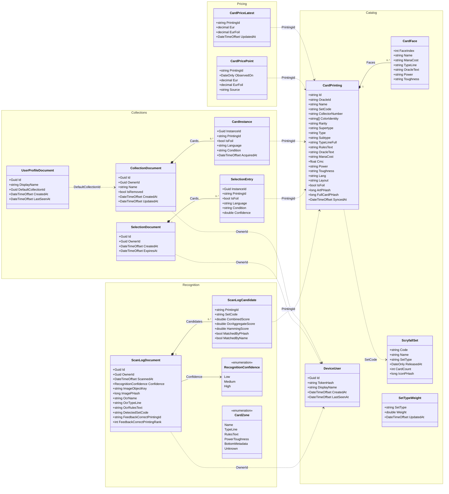

# Architecture

How LupiraMtgApi is structured: the bounded-context boundary, the two-stack persistence model, the
identity/ownership model, the recognition pipeline, and how internal results map onto HTTP.

> **Not event-sourced.** Collections, selections, and scan logs are plain **Marten documents**, not
> event streams. There are no aggregates, events, or projections in this codebase.

## Bounded contexts

The solution is five projects: four context **class libraries** plus a thin ASP.NET **host**. None
of the libraries reference ASP.NET — the boundary is compiler-enforced (a library physically cannot
take a dependency on `Microsoft.AspNetCore.*`), which keeps transport concerns in the host.

| Project | Role | Owns |
|---|---|---|
| `LupiraMtgApi.Pricing` | Leaf context | Card market EUR prices (EF Core, `prices` schema): latest snapshot + store-on-change daily history. Depends only on EF + Npgsql |
| `LupiraMtgApi.Catalog` | → Pricing | MTG reference data (EF Core, `cards`/`auth` schemas), the Scryfall source client, object-storage abstraction (`IImageStore`); reads Pricing to hydrate price into card responses |
| `LupiraMtgApi.Recognition` | → Catalog | The scan/detection engine and scan logs; **all** the heavy CV dependencies (SkiaSharp, ImageSharp, OCR client) are isolated here |
| `LupiraMtgApi.Collections` | → Catalog | Per-user state (Marten `users` schema): collections, selections, profiles |
| `LupiraMtgApi` (host) | → all four | `Program.cs`, `Endpoints/`, thin `Handlers/`, `Auth/`, and the cross-context Scryfall `Sync/` |

Dependency direction: `Catalog → Pricing`, `Collections → Catalog`, `Recognition → Catalog`,
`host → all four`. Each library uses the same internal folders — `Domain` / `Application` /
`Infrastructure` / `Data` / `Dtos` / `Mappers`.

Three placement decisions are deliberate:

- **Object storage lives in Catalog**, not a separate kernel. Recognition gets `IImageStore`
  transitively. The shared `LupiraMtgDbContext` (`cards`/`auth`) is also owned by Catalog; the other
  projects inject it directly (modular monolith, one EF migration chain).
- **Pricing is a leaf with its own `PricingDbContext`** (`prices` schema, separate migration chain).
  It is **source-agnostic**: ingest provenance is supplied per call by the caller, not assumed —
  today the Scryfall sync feeds it EUR; a future MTGJSON/Cardmarket feed could call the same ingest.
  Its own DbContext also makes a later physical-DB split a connection-string change, not a refactor.
- **The Scryfall sync lives in the host**, not Catalog. It writes Catalog data, feeds Pricing's
  ingest, *and* uses Recognition's perceptual-hash / set-symbol rasterizer to rebuild Recognition's
  indexes — so it spans contexts and cannot sit in the base Catalog without a cycle.

## Persistence

One Postgres database, two stacks, separated by schema. EF Core owns synced read-mostly reference
data; Marten owns mutable user/diagnostic state.

| Schema | Stack | Tables / documents |
|---|---|---|
| `cards` | EF Core | `card_printings`, `sets`, `set_type_weights` |
| `auth` | EF Core | `devices` |
| `prices` | EF Core | `card_prices_latest`, `card_price_points` |
| `users` | Marten | `CollectionDocument`, `SelectionDocument`, `UserProfileDocument` |
| `diagnostics` | Marten | `ScanLogDocument` |

`cards`/`auth` belong to `LupiraMtgDbContext`; `prices` to `PricingDbContext` — two EF contexts, two
migration chains (each with its own `__EFMigrationsHistory` in its schema), one database.

Notable EF mapping details:

- `card_printings.TypeLineFull` is a Postgres `GENERATED ALWAYS AS … STORED` column recomposed from
  `Supertype`/`Type`/`Subtype`. Don't write it directly — Postgres rejects the write.
- `pg_trgm` GIN indexes back fuzzy search on `Name`, `TypeLineFull`, and `RulesText`.
- `Faces` is `jsonb`; `ColorIdentity` is a Postgres `text[]`.
- `card_price_points` is keyed `(PrintingId, ObservedOn)` and written store-on-change — a row exists
  only for days a printing's price actually moved, keeping the history table sparse.

**Schema control.** Development auto-applies EF migrations (both contexts) and lets Marten
create/update its schema on boot. Production sets Marten `AutoCreate.None` and does not migrate on
boot — schema is applied deliberately in one shot with `dotnet run --project src/LupiraMtgApi --
--apply-schema` (EF `MigrateAsync` for the catalog and pricing contexts + Marten
`ApplyAllConfiguredChangesToDatabaseAsync`, then process exit).

## Identity & ownership

There is no external IdP. A **device token** is the identity:

- `POST /me/register` mints a `DeviceUser` with a random `Id` (GUID) and a `lmtg_<base64url>` token.
  Only the token's SHA-256 hash is stored (`auth.devices.TokenHash`, unique). The plaintext is
  returned once and is unrecoverable thereafter.
- On each request the `DeviceToken` auth handler hashes the presented token, looks up the device,
  and issues a principal with `sub` = device `Id` (and `name` = `DisplayName`). It throttles
  `LastSeenAt` writes via `Auth:LastSeenWriteInterval`.
- Authorization is **owner-scoped**: every user document carries an `OwnerId`, and handlers resolve
  the owner from the `sub` claim (`HttpContext.TryGetOwnerId`). A caller only ever reads/writes rows
  where `OwnerId == sub`. Marten indexes `OwnerId` on collections, selections, and scan logs.
- `UserProfileDocument.Id` is the same GUID as the device `sub` — the profile is keyed by identity,
  not a surrogate.

This is a proof-of-concept auth model: there are no roles yet, so `/admin/*` is gated only by "is
authenticated". Tightening that is future work.

## Recognition pipeline

`POST /scans` buffers the uploaded image (size-capped) and runs an ordered pipeline of `IScanStep`s.
The executor is trivial — each step transforms a shared `ScanContext`; ordering is the DI
registration order in `AddRecognition`. The steps, in order:

1. **UploadOriginal** — stash the original image in object storage (for the diagnostic detail view).
2. **Crop** — detect and normalize the card rectangle (Sobel-based `CardCropService`).
3. **PrimaryRecognition** — perceptual-hash the crop and search two in-memory BK-trees (art-crop
   hash and full-card hash), taking the lower Hamming distance per candidate.
4. **ZoneClassify** — call the external OCR service and classify text into card zones
   (`Name`, `TypeLine`, `RulesText`, `PowerToughness`, `BottomMetadata`).
5. **ZoneScore** — score OCR text against the catalog via per-zone `pg_trgm` trigram queries.
6. **RotationRetry** — re-run upstream steps rotated when the first pass is weak (no-op otherwise).
7. **Fusion** — combine the pHash and OCR signals into a single ranked candidate list (weights from
   `Scan:Scoring`, e.g. `PHashWeight` / `OcrWeight`).
8. **SetTypeWeight** — bias candidates by their printing's set type (core/expansion up, funny down),
   using the live `set_type_weights` and an optional set-symbol detection boost.
9. **Hydrate** — attach each candidate's printing metadata + presigned image URLs.
10. **Confidence** — derive `High` / `Medium` / `Low` from combined scores and zone agreement.
11. **RecordOutcome** / **PersistScanLog** — persist a `ScanLogDocument` (OCR zones, every candidate
    with sub-scores, set-symbol detection, latencies) to the `diagnostics` schema.

The pHash and set-symbol indexes are rebuilt by hosted bootstrappers at startup and after each sync.
Recognition **degrades gracefully**: if the OCR service is down it falls back to pHash-only
candidates; until the pHash index finishes its background build, scans return weaker OCR-only
matches rather than erroring.

`POST /scans/{id}/feedback` records which printing was actually correct (and its rank in the
original candidate pool) on the scan log — training data for future ranker work.

## Error handling & transport mapping

Application services stay transport-neutral. The Collections context returns a minimal `Op<T>`
(`Ok` / `NotFound` / `Invalid` / `Conflict`); other services return DTOs / nullables / `bool`. The
thin host handlers map those onto HTTP, and 4xx bodies are emitted as RFC 7807
`application/problem+json` via the shared `Problems` helper.

| Internal result | HTTP | Body |
|---|---|---|
| `Op.Ok(value)` | `200 OK` | the value DTO |
| `Op.NotFound()` / missing entity | `404 Not Found` | — |
| `Op.Invalid(error)` | `400 Bad Request` | `problem+json` (`title`, `detail`, `status`) |
| `Op.Conflict(error)` | `409 Conflict` | `problem+json` |
| Unauthenticated | `401 Unauthorized` | — (auth middleware) |
| Soft-delete / remove | `204 No Content` | — |
| Rate limit exceeded | `429 Too Many Requests` | — |

## Domain model

The persisted domain across the three contexts. Composition (filled diamond) marks value objects
embedded in their parent document/row (Marten `jsonb` arrays, or EF `jsonb` for `Faces`). Dashed
arrows are **logical id references across stores** — they are *not* database foreign keys, because
the referencing and referenced data live in different stacks (Marten ↔ EF) and are joined in
application code at hydration time.

Field notes (the diagram shows the substantive fields; a few are summarized):

- `CardPrinting` mirrors its front face to the top-level columns for the (front-face-only)
  recognizer; `Faces` is populated only for multi-faced layouts (transform, modal DFC, split, flip,
  adventure, meld). Image object keys (`ImageObjectKey`, `ImageArtCropKey`) and set-icon keys are
  omitted from the diagram for brevity.
- Prices live in the **Pricing** context, not on `CardPrinting`: `CardPriceLatest` is the hot
  per-printing snapshot surfaced on `CardPrintingResponse.Prices`; `CardPricePoint` is the
  store-on-change history behind `GET /cards/{oracleId}/printings/{printingId}/prices`.
- `ScanLogDocument` additionally carries per-zone OCR confidences, latency counters, crop metadata,
  and a set of `Extracted*` fields reserved for richer extractors — omitted here.
